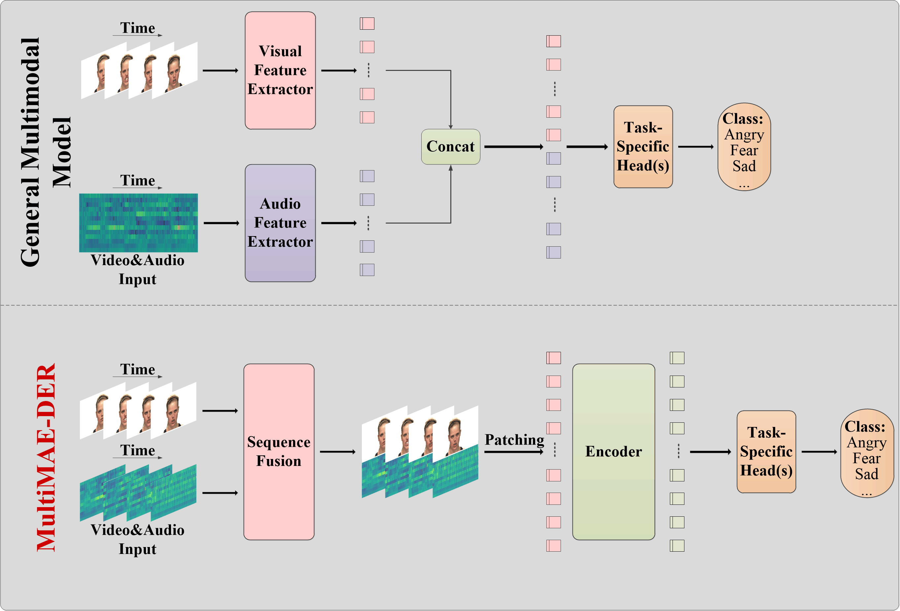
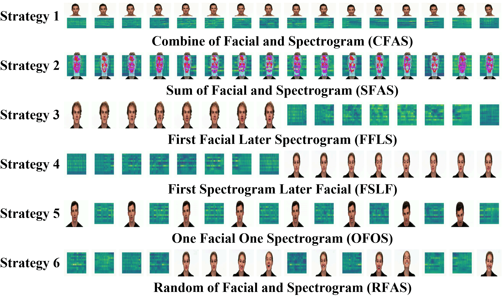
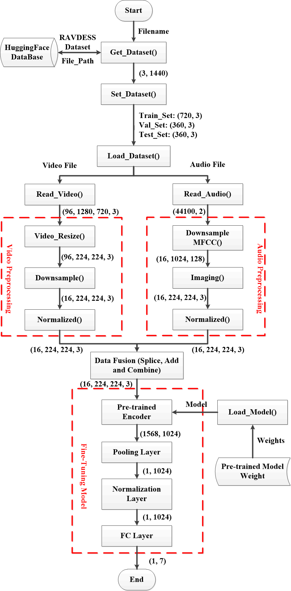
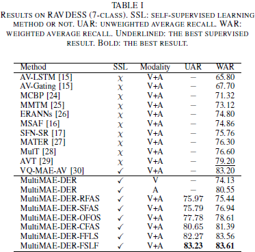
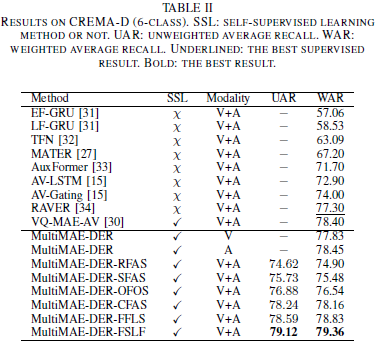
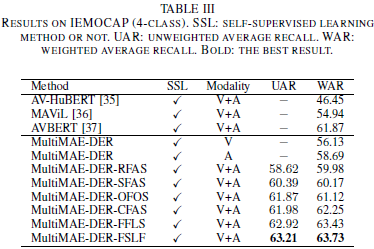

# MultiMAE-DER: Multimodal Masked Autoencoder for Dynamic Emotion Recognition (IEEE ICPRS 2024)

[](https://paperswithcode.com/sota/emotion-recognition-on-ravdess?p=multimae-der-multimodal-masked-autoencoder)<br>
[](https://paperswithcode.com/sota/video-emotion-recognition-on-crema-d?p=multimae-der-multimodal-masked-autoencoder)<br>
[](https://paperswithcode.com/sota/multimodal-emotion-recognition-on-iemocap?p=multimae-der-multimodal-masked-autoencoder)<br>

> [](https://hcps.fiu.edu/) | [](https://arxiv.org/abs/2404.18327) | [`BibTeX`](#citation) |
> [](https://ieeexplore.ieee.org/document/10677820)<br>
> [Peihao Xiang](https://scholar.google.com/citations?user=k--3fM4AAAAJ&hl=zh-CN&oi=ao), [Chaohao Lin](https://scholar.google.com/citations?hl=zh-CN&user=V3l7dAEAAAAJ), [Kaida Wu](https://ieeexplore.ieee.org/author/167739911238744), and [Ou Bai](https://scholar.google.com/citations?hl=zh-CN&user=S0j4DOoAAAAJ)<br>
> HCPS Laboratory, Department of Electrical and Computer Engineering, Florida International University<br>

[](https://colab.research.google.com/github/Peihao-Xiang/MultiMAE-DER/blob/main/MultiMAE-DER_Fine-Tuning%20Code/MultiMAE_DER_FSLF.ipynb)
[](https://huggingface.co/datasets/NoahMartinezXiang/RAVDESS)

Official TensorFlow implementation and pre-trained VideoMAE models for MultiMAE-DER: Multimodal Masked Autoencoder for Dynamic Emotion Recognition.

Note: The .ipynb is just a simple example. In addition, the VideoMAE encoder model should be pre-trained using the MAE-DFER method, but this repository does not provide it.

## Overview

This paper presents a novel approach to processing multimodal data for dynamic emotion recognition, named as the Multimodal Masked Autoencoder for Dynamic Emotion Recognition (MultiMAE-DER). The MultiMAE-DER leverages the closely correlated representation information within spatiotemporal sequences across visual and audio modalities. By utilizing a pre-trained masked autoencoder model, the MultiMAE-DER is accomplished through simple, straightforward finetuning. The performance of the MultiMAE-DER is enhanced by optimizing six fusion strategies for multimodal input sequences. These strategies address dynamic feature correlations within cross-domain data across spatial, temporal, and spatiotemporal sequences. In comparison to state-of-the-art multimodal supervised learning models for dynamic emotion recognition, MultiMAE-DER enhances the weighted average recall (WAR) by 4.41% on the RAVDESS dataset and by 2.06% on the CREMA-D. Furthermore, when compared with the state-of-the-art model of multimodal self-supervised learning, MultiMAE-DER achieves a 1.86% higher WAR on the IEMOCAP dataset.

<p align="center">
  <br>
  Illustration of our MultiMAE-DER.
</p>

General Multimodal Model vs. MultiMAE-DER. The uniqueness of our approach lies in the capability to extract features from cross-domain data using only a single encoder, eliminating the need for targeted feature extraction for different modalities.

<p align="center">
  <br>
  Multimodal Sequence Fusion Strategies.
</p>

## Implementation details

<p align="center">
   <br>
  The architecture of MultiMAE-DER.
</p>

## Main Results

### RAVDESS



### CREMA-D



### IEMOCAP



## Contact 

If you have any questions, please feel free to reach me out at pxian001@fiu.edu.

## Acknowledgments
This project is built upon [VideoMAE](https://github.com/innat/VideoMAE) and [MAE-DFER](https://github.com/sunlicai/MAE-DFER). Thanks for their great codebase.

## License

This project is under the Apache License 2.0. See [LICENSE](LICENSE) for details.

## Citation

If you find this repository helpful, please consider citing our work:

```BibTeX
@misc{xiang2024multimaeder,
      title={MultiMAE-DER: Multimodal Masked Autoencoder for Dynamic Emotion Recognition}, 
      author={Peihao Xiang and Chaohao Lin and Kaida Wu and Ou Bai},
      year={2024},
      eprint={2404.18327},
      archivePrefix={arXiv},
      primaryClass={cs.CV}
}

@INPROCEEDINGS{10677820,
  author={Xiang, Peihao and Lin, Chaohao and Wu, Kaida and Bai, Ou},
  booktitle={2024 14th International Conference on Pattern Recognition Systems (ICPRS)}, 
  title={MultiMAE-DER: Multimodal Masked Autoencoder for Dynamic Emotion Recognition}, 
  year={2024},
  volume={},
  number={},
  pages={1-7},
  keywords={Emotion recognition;Visualization;Correlation;Supervised learning;Semantics;Self-supervised learning;Transformers;Dynamic Emotion Recognition;Multimodal Model;Self-Supervised Learning;Video Masked Autoencoder;Vision Transformer},
  doi={10.1109/ICPRS62101.2024.10677820}}
```
